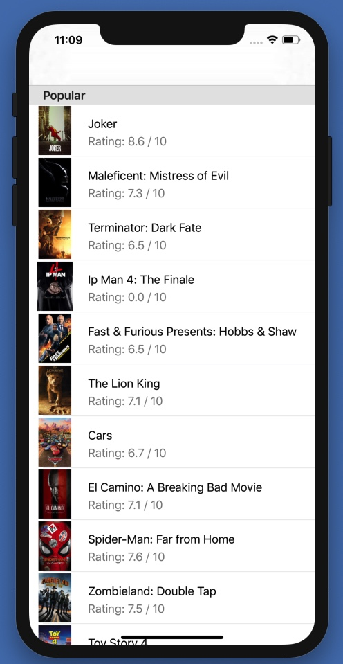

# mobile-ios-interview

Movie Challenge

## Getting Started

These instructions will get you a copy of the project up and running on your local machine for development and testing purposes. Deployment notes to be added once applicable.

### Prerequisites

Xcode 11.1 or newer

### Installation

```
git clone https://github.com/TangoGroup/mobile-ios-interview.git
```

## Objective

Create a basic Movie app in Swift to show a list of movies and allow a user to select a movie to see more details.  We will be using this exercise to get a better idea of your coding style, technologies/libraries used, architectural choices, etc.

The main screen of the app should show a list of movies organized into at least 3 different sections. For example, your sections could be “Comedy”, “Action”, and “Popular” movies, similar to what you see on Netflix. Each movie item should show, at a minimum, the movie title and an image of the movie poster.
When a movie is clicked, the user should be taken to a details page.  This page should show an image of the movie, the title, the rating, and the associated genre of the movie.



## Stretch Goals

Display each section’s movies in its own unique way. For example, a Comedy section might display smaller, basic cells, but a Popular section could display much more prominent cells with a larger image. An example custom class is given to you below. Can you build more?
Show any additional information in a movie’s cell that you think would be a nice addition.
Add some additional functionality, like removing a movie from the list, or even adding a new movie!

## Hints
- Example json resonse is under `Networking/ExampleMovieResponse.json`
- We recommend you use a UITableView, but you are welcome to use a UICollectionView if you prefer.
- Build two separate view controllers, one for the list of movies and one for the details page.


